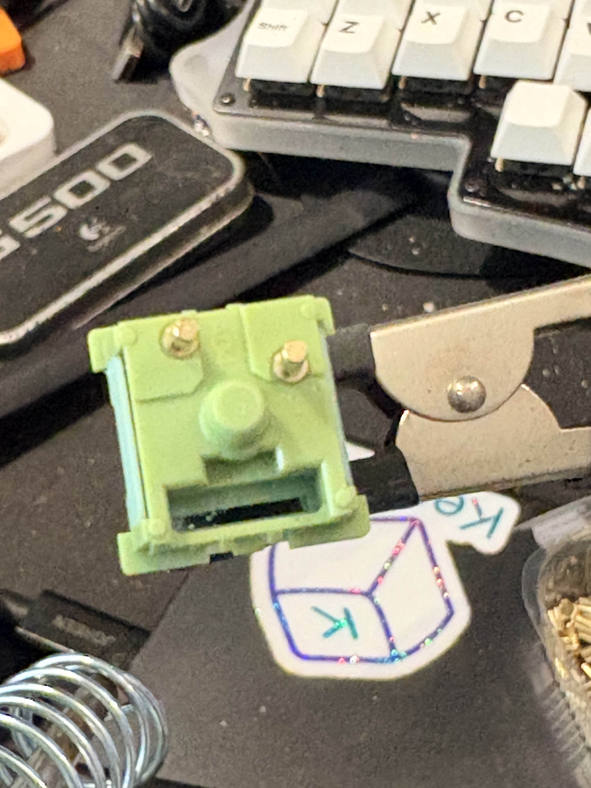
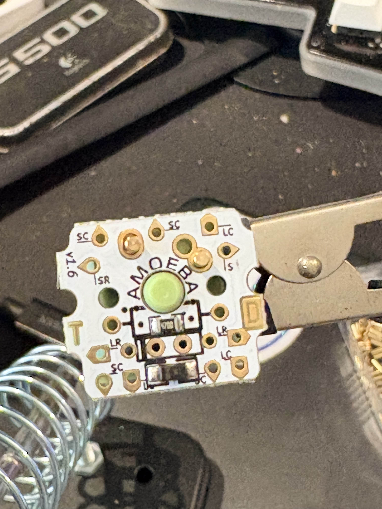
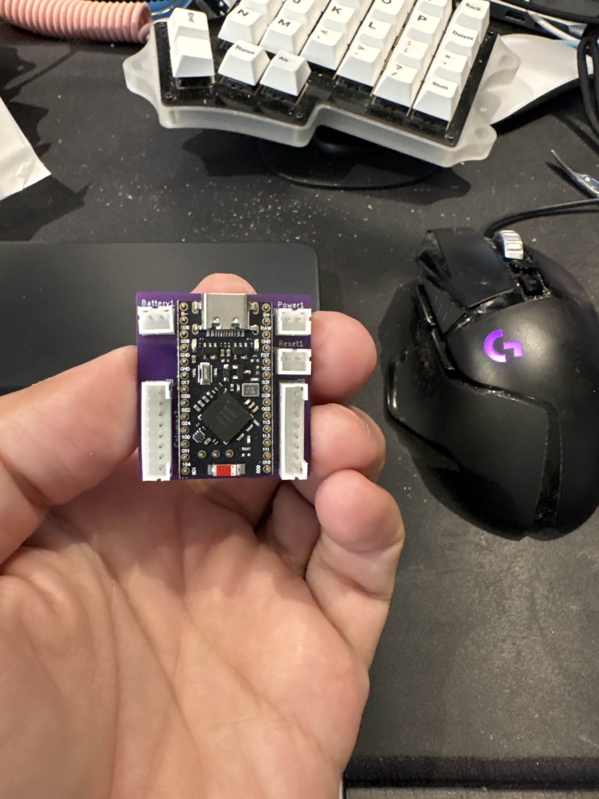
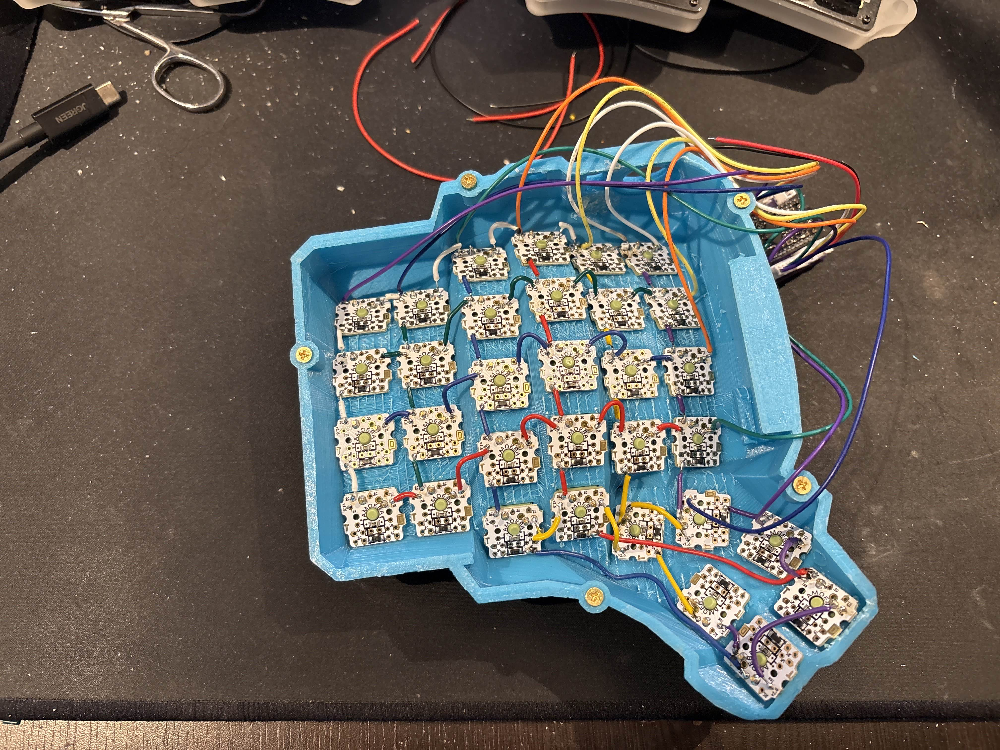

[TOC]

# Step 1 - 3d printing

source the 3d printed keyboard body. link to the one i used is in the [BOM](./BOM.md). If you decide to use the same one, and also decide to use single key pcb's make sure to print out the spacers as well. 

# Step 2 - assembly

populate the both body parts with switches. note that the switch orientation for the thumb cluster might be a bit different than the rest. this is due to amoeba pcb size and orientation, making sure everything fits.

# Step 3 - pcb's and controller

prepare the PCB's with hotswap sockets. I used one switch for this, put both sockets on it, and then carefully soldered it to the pcb making sure not to solder the switch in the process.

Step 4: start wiring up the controller pcb. Also make sure to send it to manufacturing with jlcpcb (which i used) or any other pcb manufacturer of your choice. make sure that the orientation of the sockets is the same like the photo below:

Note that you don't have to use the 3 pin header since its not connected anywhere for this version. Connect the 8 pin cables to the finished pcb and start soldering the grid. I highly recommend to start with the controller wires and only insert the pcb's after the controller wires have been connected. 

For the wiring diagram use the following graphic that i blatantly stole from https://github.com/morphykuffour/morphykuffour.github.io

note that TRRS is not used and just ignore. Take special care to wire the left and right side columns in correct order. After this two wires on each header will be unused (red and black) so just cut them off so they don't end up shorting something that shouldn't be shorted.

# Step 4 - more soldering

Wire up the whole grid. just go row to row, and column to column. the order in which the switches are wired within a single row or column doesnt matter so feel free to improvise in the tmub cluster as long as each key is wired to the correct row and column

# Step 5 - assembly

Prepare the power switch, reset switch, and the usb extension cable. When preparing the power switch, note that the hole in the keyboard case is a bit too smal. either drill it out to a larger size, or use a hot soldering iron to melt it a bit. Solder one dual pin jst cable to the reset switch, and one to the power switch. For the power switch make sure to use the center and one of the side pins. The switch itself has 3 positions, and thre position away from the side  pin used with be your 'on' position.

When preparing the usb extension cable you can either make a frehs one, or use an old type C cable like I did and just solder it to the female socket from the BOM. I recommend making a fresh one to your desired length, and just make sure to solder the correct wires: ground to ground, +5v to +5v, d+ to d+ and d- to d- 

Assemble the case, plug everything in, plug the battery in and let it charge overnight

Press in the brass inserts for the screws into holes in the case- close the case, and add as many silicone feet as you see fit (i have about 15 on each side)

# Step 6 - firmware

Prepare tne dongle. In my case it was a leftover Seeeduino Xiao BLE in a small 3d printed case made just for it. Flash the firmware: use [my firmware repo](https://github.com/adaryorg/zmk_dactyl) or  fork it and make any adjustments to your liking. My firmware repo will build a few firmware images, and the initial flashing procedure should be as following:

1. flash settings_reset-seeeduino_xiao_ble-zmk.uf2 to the dongle
2. flash dactyl_dongle-seeeduino_xiao_ble-zmk.uf2 to the dongle and disconnevct it
3. flash settings_reset-nice_nano_v2-zmk.uf2 to the both sides of the keyboard
4. flash dactyl_left-nice_nano_v2-zmk.uf2 to the left side of the keyboard
5. flash dactyl_right-nice_nano_v2-zmk.uf2 to the right side of the keyboard

make sure that both sides of the keyboard are powered off and disconnected from the usb. Power on the dongle (connect it to the computer with an USB cable)  and then power on the left side of the keyboard first, and the right side second. If everything worked good, the keyboard should be in perfect working order with the default keymap that I set, and it should be capable of connecting to ZMK studo (esc+backspace is the unlock combo for zmk studio)