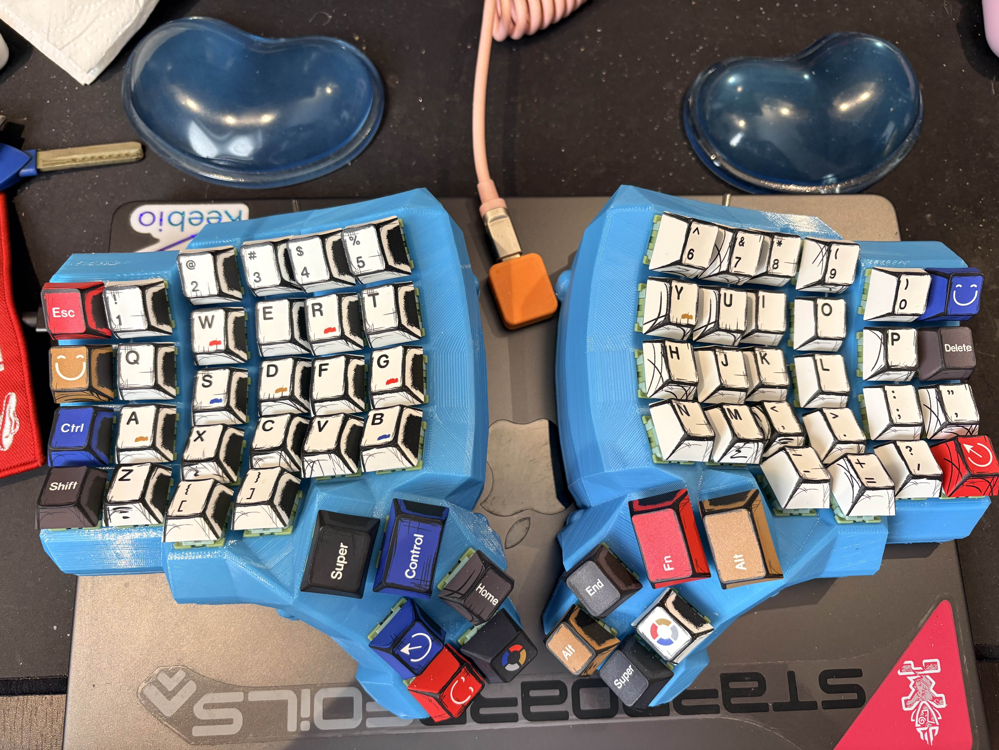
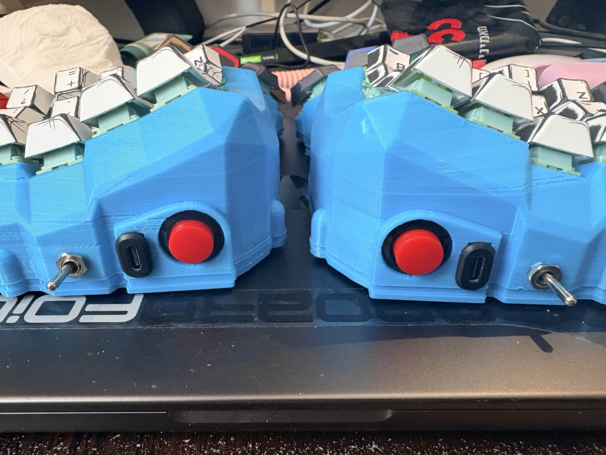

# Custom Dactyl manuform keyboard build guide and BOM

More details on this build in the [build guide](./BUILD_GUIDE.md)

There are many other keyboards like it but this one is mine!

The back story for this keyboard is simple. I wanted a dactyl manuform for a long time, and wasn't willing to pay the premium that on-line builders are asking for. Lets be real, Pretty much everyone will use the same 3d printed parts, and get the rest of the hardware from aliexpress, so i started researching to see how much would it cost to build one myself.

Long story short i found a few blogs and build logs, and decided to go for it. I started off following [this guide](https://dkojovic.medium.com/detailed-guide-on-how-to-build-your-first-dactyl-manuform-keyboard-a412630de76f) for a hand wired dactyl keyboard. I sourced the exact parts he was used, i had a friend 3d print me the keyboard body, and within a few fun days i had a working hand-wired dactyl keyboard and that is when the real fun started. I wanted to build something that is modular, hot swappable, easier to repair and troubleshoot than the hand wired one, and of course wireless!

Check out the [build guide](./BUILD_GUIDE.md) for more info and details

Check out the [BOM](BOM.md) for all the parts needed

Firmware can be found [here](https://github.com/adaryorg/zmk_dactyl)

Special thanks to:

* Morphy Kuffour https://github.com/morphykuffour
* Darko Kojovic https://github.com/DKSadx
